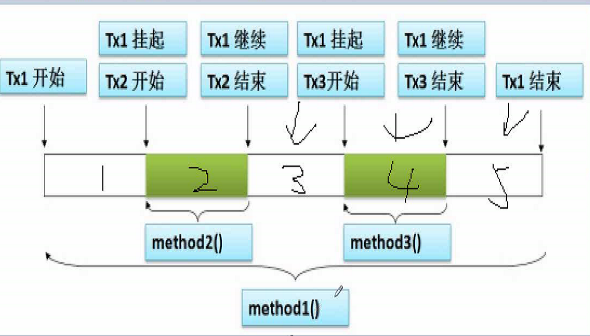
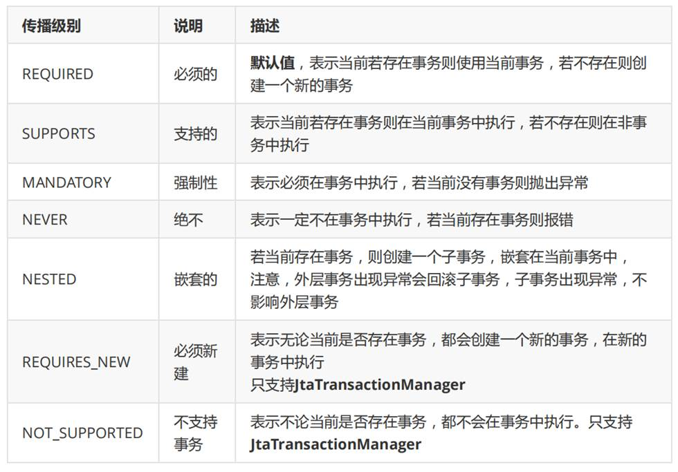

# 1.Spring-Ioc-控制反转

## 1.Ioc-xml文件注入

### 1.简单类型注入

#### 1.set注入 及 构造注入

`1.applicationContext.xml`

```xml
<?xml version="1.0" encoding="UTF-8"?>
<beans xmlns="http://www.springframework.org/schema/beans"
       xmlns:xsi="http://www.w3.org/2001/XMLSchema-instance"
       xsi:schemaLocation="http://www.springframework.org/schema/beans http://www.springframework.org/schema/beans/spring-beans.xsd">

    <!--
    id:自定义,唯一;
    class:接口的实现类全限定类名
    -->

<!--   SomeServiceImpl -->
    <bean id="someService" class="com.bjpowernode.service.impl.SomeServiceImpl"/>

<!--    Student  set注入-->
    <bean id="myStudent" class="com.bjpowernode.entity.Student">
        <property name="name" value="rose"/>
        <property name="age" value="18"/>
    </bean>
    <!--    User 构造注入  如果这里书写的顺序和构造参数顺序不一致,可以通过 index(索引,从0开始)指定;
							也可以使用name指定属性名称-->
    <bean id="myUser" class="com.bjpowernode.entity.User">
        <constructor-arg name="password" value="123456" index="1"或 name="password" />
        <constructor-arg name="username" value="Tina"  index="0" 或 name="username"/>
    </bean>
</beans>

public User(String username, String password) {
        System.out.println("User有参构造执行了===========");
        this.username = username;
        this.password = password;
    }
```


`2.创建对象`

> 特别注意:		
>
> //这里会调用无参构造方法,进行对象的创建,这里会将xml文件中所有的对象都创建
>         ApplicationContext context = new ClassPathXmlApplicationContext(resource);

```java
public class StudentTest {

    private static Student student = null;

    @BeforeClass
    public static void create() {
        String resource = "applicationContext.xml";
        //这里会调用无参构造方法,进行对象的创建,这里会将xml文件中所有的对象都创建
        ApplicationContext context = new ClassPathXmlApplicationContext(resource);
        student = (Student) context.getBean("myStudent");
    }
    @Test
    public void setStudent(){
        System.out.println(student);
    }
}
```


### 2.引用类型注入

#### 1.手动注入

```xml
<!--    Student  set注入-->
<bean id="myStudent" class="com.bjpowernode.entity.Student" >
        <property name="name" value="rose"/>
        <property name="age" value="18"/>
    <!--        时间格式  yyyy/MM/dd-->
        <property name="birthday" value="2000/11/19"/>
<!--        手动注入-->
        <property name="school" ref="mySchool"/>
    </bean>
<!--    引用类型-->
    <bean id="mySchool" class="com.bjpowernode.entity.School">
        <property name="name" value="北京大学"/>
        <property name="address" value="北京"/>
    </bean>
```


#### 2.自动注入

`1.byName 按照属性名注入`

```xml
<!--    Student  set注入-->
    <bean id="myStudent" class="com.bjpowernode.entity.Student" autowire="byName">
        <property name="name" value="rose"/>
        <property name="age" value="18"/>
    </bean>
<!--    引用类型 按照byName  id和属性名一致-->
    <bean id="school" class="com.bjpowernode.entity.School">
        <property name="name" value="清华大学"/>
        <property name="address" value="北京"/>
    </bean>
```


`2.byType 按照引用属性的类型注入`

```xml
<!--    Student  set注入-->
<bean id="myStudent" class="com.bjpowernode.entity.Student" autowire="byType">
    <property name="name" value="rose"/>
    <property name="age" value="18"/>
</bean>
<!--    引用类型 按照byType-->
<bean id="mySchool" class="com.bjpowernode.entity.School">
    <property name="name" value="河南大学"/>
    <property name="address" value="河南"/>
</bean>
```


## 2.DI注解注入

```
@Repository 用于对 DAO 实现类进行注解

@Service 用于对 Service 实现类进行注解

@Controller 用于对 Controller 实现类进行注解

这三个注解与@Component 都可以创建对象，但这三个注解还有其他的含义，@Service
创建业务层对象，业务层对象可以加入事务功能，@Controller 注解创建的对象可以作为处
理器接收用户的请求。
```

### 1.@Autowired

```
按照byType方式进行注入,使用该注解完成属性注入时，类中无需 setter。
```


### 2.@Resource

```
默认按照byName注入,如果注入失败,则再次使用byType的方式进行注入
```


# 2.AOP面向切面编程

## 1.代理

### 1.静态代理

`详情见代码Spring-Aop`

### 2.动态代理

`详情见代码Spring-Aop`

`1.JDK动态代理`

```
implements InvocationHandler
```


`2.Cglib动态代理`

```
implements MethodInterceptor
```


### 3.AOP底层

```
AOP底层，就是采用动态代理模式实现的。采用了两种代理：JDK 的动态代理，与cglib的动态代理。

利用AOP可以对各个业务逻辑的各个部分进行隔离,从而使各个业务逻辑之间耦合度降低,提高程序的可重用性,同时提高开发的效率.

面向切面编程就是将交叉业务逻辑封装成切面,利用AOP容器织入到主业务逻辑中.所谓交叉业务逻辑就是指通用的,与主业务逻辑无关的代码,比如安全检查,日志,事务,缓存等;
如果不使用AOP,会让主业务变得臃肿,复杂;

```


## 1.AOP编程术语

`1.Aspect切面`

```
切面泛指交叉业务逻辑。
```


`2.JoinPoint连接点`

```
连接点指可以被切面织入的具体方法。通常业务接口中的方法均为连接点。
```


`3.Pointcut切入点`

```
切入点指声明的一个或多个连接点的集合。通过切入点指定一组方法。
被标记为 final 的方法是不能作为连接点与切入点的。因为最终的是不能被修改的，不
能被增强的。

```


`4.Target目标对象`

```
目 标 对 象 指 将 要 被 增 强 的 对 象 。 即 包 含 主 业 务 逻 辑 的 类 的 对 象 。
上 例 中 的 StudentServiceImpl 的对象若被增强，则该类称为目标类，该类对象称为目标对象。
当然， 不被增强，也就无所谓目标不目标了。
```


`5.Advice通知`

```
通知定义了增强代码切入到目标代码的时间点，是目标方
法执行之前执行，还是之后执行等。通知类型不同，切入时间不同。
```


`总结:切入点定义切入的位置，通知定义切入的时间。`


## 2.AspectJ 的切入点表达式

```java
execution(访问权限(可省略) 方法返回值 方法声明(参数) 异常类型(可省略))
    
```


### 1.切入点表达式

```java
//*..表示所有包下的service包
//*.表示一级包下的service包
//service..*表示service下的所有子包和类
//service.*表示service下的一级包里面的类及其子类

//@Before(value = "execution(* com.bjpowernode.service.impl.StudentServiceImpl.doSome(..))")
//@Before(value = "execution(* com.bjpowernode.service..*.doSome(..))")
//@Before(value = "execution(* *..service.impl.StudentServiceImpl.doSome(..))")
@Before(value = "execution(* *..service..*.doSome(..))")
//@Before(value = "execution(* *..service..*.do*(..))")
//@Before(value = "execution(* *..service..*.*(..))")
```


### 2.事例

`1.Aspect类`

`注意:使用AOP开发,创建对象时 只能用实现类的接口`

```java
@Aspect
@Component
public class MyAspect {
    
    //定义切入点
    @Pointcut(value = "execution(* *..serviceAspect..*.*(..))")
    public void myPointcut(){
        //无需代码
    }
    
     /*
    * 最终通知,抛出异常也会执行
    * */
    @After(value = "myPointcut()")
    public void myAfterReturning2(){
        System.out.println("后置通知,抛出异常也执行");
    }
     
    //访问权限(可省略) 方法返回值 方法声明(参数) 异常类型(可省略)
    //@Before(value = "execution(* com.bjpowernode.service.impl.StudentServiceImpl.doSome(..))")
    //@Before(value = "execution(* com.bjpowernode.service..*.doSome(..))")
    //@Before(value = "execution(* *..service.impl.StudentServiceImpl.doSome(..))")
    @Before(value = "execution(* *..service..*.doSome(..))")
    //@Before(value = "execution(* *..service..*.do*(..))")
    //@Before(value = "execution(* *..service..*.*(..))")
    public void myBefore(){
        System.out.println("前置通知=======");
    }

   /* 后置通知, 不会改变目标方法的返回结果
        1.不写returning,且myAfterReturning方法没有参数时,可以用于任何方法上;
        2.写returning,且myAfterReturning方法有参数时,只能用在有返回值的方法,否则会报错;
     */
    @AfterReturning(value = "execution(* *..service..*.doAny(..))", returning = "result")
    public int myAfterReturning(Object result){
        int i = (int) result;
        System.out.println("后置通知,获取方法的返回值" + i);
        return i+2;
    }

    /*
    * 环绕通知,增强方法有 ProceedingJoinPoint参数;
    * 可以改变目标方法的返回结果,
    * 若目标方法有返回值，则该方法的返回值就是目标方法的返回值
    * */
    @Around(value = "execution(* *..service..*.doOther(..))")
    public int myAround(ProceedingJoinPoint pjp) throws Throwable {
        System.out.println("环绕通知,在目标方法执行之前执行");
        //调用目标方法
        int i = (int) pjp.proceed();
        System.out.println("环绕通知,在目标方法执行之后执行");
        return i+2;
    }
    /*
    * 可以使用在没有返回值的目标方法上,该方法有没有返回值都可以
    * */
    @Around(value = "execution(* *..service..*.doSome(..))")
    public void myAround2(ProceedingJoinPoint pjp) throws Throwable {
        System.out.println("环绕通知,在目标方法执行之前执行");
        //调用目标方法
        pjp.proceed();
        System.out.println("环绕通知,在目标方法执行之后执行");
    }
}
```


`2.service`

```java
@Service
public class StudentServiceImpl implements StudentService {
    @Override
    public void doSome(String name, int age) {
        System.out.println("doSome()方法执行");
    }

    @Override
    public int doAny(int id) {
        System.out.println("doAny()方法执行");
        return id;
    }

    @Override
    public int doOther(int id) {
        System.out.println("doOther()方法执行");
        return id;
    }
}
```


`3.test`

```java
public class StudentServiceTest {
    @Test
    public void doSome(){
        ApplicationContext context = new ClassPathXmlApplicationContext("applicationContext.xml");
        StudentService studentService = context.getBean(StudentService.class);
        studentService.doSome("rose",20);
    }
    @Test
    public void doAny(){
        ApplicationContext context = new ClassPathXmlApplicationContext("applicationContext.xml");
        StudentService studentService = context.getBean(StudentService.class);
        int i = studentService.doAny(20);
        System.out.println(i);
    }

    @Test
    public void doOther(){
        ApplicationContext context = new ClassPathXmlApplicationContext("applicationContext.xml");
        StudentService studentService = context.getBean(StudentService.class);
        int i = studentService.doOther(18);
        System.out.println(i);
    }
}
```


`4.applicationContext`

```xml
<?xml version="1.0" encoding="UTF-8"?>
<beans xmlns="http://www.springframework.org/schema/beans"
       xmlns:xsi="http://www.w3.org/2001/XMLSchema-instance" xmlns:aop="http://www.springframework.org/schema/aop"
       xmlns:context="http://www.springframework.org/schema/context"
       xsi:schemaLocation="http://www.springframework.org/schema/beans http://www.springframework.org/schema/beans/spring-beans.xsd http://www.springframework.org/schema/aop https://www.springframework.org/schema/aop/spring-aop.xsd http://www.springframework.org/schema/context https://www.springframework.org/schema/context/spring-context.xsd">
    
<!--    使用xml的方式-->
<!--    <bean id="studentService" class="com.bjpowernode.service.impl.StudentServiceImpl"/>-->
<!--    <bean id="myAspect" class="com.bjpowernode.aspect.MyAspect"/>-->
    
<!--    使用注解的方式创建对象-->
    <context:component-scan base-package="com.bjpowernode"/>
    <!--其工作原理是，<aop:aspectj-autoproxy/>通过扫描找到@Aspect 定义的切面类，再由切
        面类根据切入点找到目标类的目标方法，再由通知类型找到切入的时间点。-->
    <aop:aspectj-autoproxy/>
</beans>
```


# 3.Spring整合Mybatis

`mybatis-config.xml`

```xml
<?xml version="1.0" encoding="UTF-8" ?>
<!DOCTYPE configuration
        PUBLIC "-//mybatis.org//DTD Config 3.0//EN"
        "http://mybatis.org/dtd/mybatis-3-config.dtd">
<configuration>
    
    <settings>
        <setting name="logImpl" value="org.apache.ibatis.logging.stdout.StdOutImpl"/>
    </settings>

    <typeAliases>
        <package name="com.bjpowernode.entity"/>
    </typeAliases>

    <plugins>
        <plugin interceptor="com.github.pagehelper.PageInterceptor"/>
    </plugins>

</configuration>
```


`applicationContext.xml`

```xml
<?xml version="1.0" encoding="UTF-8"?>
<beans xmlns="http://www.springframework.org/schema/beans"
       xmlns:xsi="http://www.w3.org/2001/XMLSchema-instance"
       xmlns:context="http://www.springframework.org/schema/context"
       xsi:schemaLocation="http://www.springframework.org/schema/beans http://www.springframework.org/schema/beans/spring-beans.xsd http://www.springframework.org/schema/context https://www.springframework.org/schema/context/spring-context.xsd">
    <!--扫描组件-->
    <context:component-scan base-package="com.bjpowernode"/>

    <!--    加载资源文件-->
    <context:property-placeholder location="classpath:jdbc.properties"/>

    <!--    配置数据源-->
    <bean id="dataSource" class="com.alibaba.druid.pool.DruidDataSource">
        <property name="driverClassName" value="${jdbc.mysql.driver}"/>
        <property name="url" value="${jdbc.mysql.url}"/>
        <property name="username" value="${jdbc.mysql.username}"/>
        <property name="password" value="${jdbc.mysql.password}"/>
    </bean>

    <!--    SqlSessionFactory-->
    <bean id="sqlSessionFactory" class="org.mybatis.spring.SqlSessionFactoryBean">
        <!--        数据源-->
        <property name="dataSource" ref="dataSource"/>
        <!--        加载mybatis核心文件-->
        <property name="configLocation" value="classpath:mybatis-config.xml"/>
        <!--        加载mapper文件-->
        <property name="mapperLocations" value="classpath:mapper/*.xml"/>
    </bean>

    <!--    mybatis代理对象-->
    <bean class="org.mybatis.spring.mapper.MapperScannerConfigurer">
        <!--配置SqlSessionFactory name是sqlSessionFactoryBeanName, 则value传的是字符串
 			找到和字符串相同名字的bean;
		-->
        <property name="sqlSessionFactoryBeanName" value="sqlSessionFactory"/>
        <!--配置mapper接口-->
        <property name="basePackage" value="com.bjpowernode.mapper"/>
    </bean>
</beans>

```


# 4.Spring事务

## 1.事务属性

### 1.事物的传播性  propagation

```
REQUIRED:默认值.当前方法若存在事务,则被调用方法使用当前事务;若不存在事务,则被调用方法创建一个事务.

SUPPORTS:若当前方法存在事务,则在当前事务中执行;若不存在事务,则在非事务中执行

REQUIRED_NEW: 当前方法无论是否存在事务,被调用方法都会新建一个事务.如图:
1.如果3出现异常,1,3事务回滚,2是独立的事务,已经提交不会回滚;
2.如果4出现异常,那么method1()也相当于抛出异常,1,3,4会回滚;
注意:在Spring中,当一个service调用自己的方法时,一直都会在同一个事务中执行,不会创建新的事务.

```


`REQUIRED_NEW`







### 2.回滚列表

```
在Spring事务管理中,只回滚运行时异常

rollback-for="java.lang.Exception"代表所有异常都会回滚,如果要配置多个,逗号隔开即可
```


### 3.只读事务

```
如果当前事务方法中的sql为查询方法,建议设置成read-only="true"
```


### 4.事务的超时控制

```
一个事务默认执行时间为无限制,可以通过timeout来控制事务超时时间;
事务超时会回滚事务
```


## 1.xml方式

```xml
<bean id="transactionManager" class="org.springframework.jdbc.datasource.DataSourceTransactionManager">
    <property name="dataSource" ref="dataSource"/>
</bean>
<!--    如果上面的id是transactionManager, 这里的transaction-manager属性可以省略(默认值就是它)-->
<tx:advice id="txAdvice" transaction-manager="transactionManager">
        <tx:attributes>
            <tx:method name="find*" read-only="true"/>
            <tx:method name="select*" read-only="true"/>
            <tx:method name="*list*" read-only="true"/>
            <tx:method name="add*" rollback-for="java.lang.Exception" />
            <tx:method name="save*" rollback-for="java.lang.Exception" />
            <tx:method name="update*" rollback-for="java.lang.Exception" />
            <tx:method name="edit*" rollback-for="java.lang.Exception" />
            <tx:method name="delete*" rollback-for="java.lang.Exception" />
            <tx:method name="del*" rollback-for="java.lang.Exception" />
            <tx:method name="remove*" rollback-for="java.lang.Exception" />
        </tx:attributes>
    </tx:advice>

<aop:config>
    <aop:pointcut id="mypoint" expression="execution(* *..service..*.*(..))"/>
    <aop:advisor advice-ref="txAdvice" pointcut-ref="mypoint"/>
</aop:config>
```


## 2.注解的方式

`注解可以写在类上,也可以写在方法上`

```java
@Transactional(rollbackFor = Exception.class)
```


`开启事务注解`

```xml
<!--    使用注解-->
    <tx:annotation-driven />
```


# 5.依赖的作用域

```
compile(默认值)	  作用域，jar包会全程参与

test 		作用域，只会对测试程序目录生效，且不参与打包

provided 	作用域，只参与开发，不参与打包。
例如：servlet和jsp的jar包，可以在pom文件中引入，这样在开发web项目时就可以直接使用相关的api,但是实际运行时，项目在tomcat服务器中运行，tomcat服务器有自己的相关jar包，此时项目有jsp和servlet的jar包，tomcat自身也有，会出现jar包冲突，基于这样的情况，设置项目中jar包的作用域provided

```


